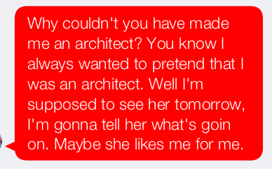
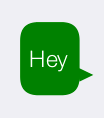
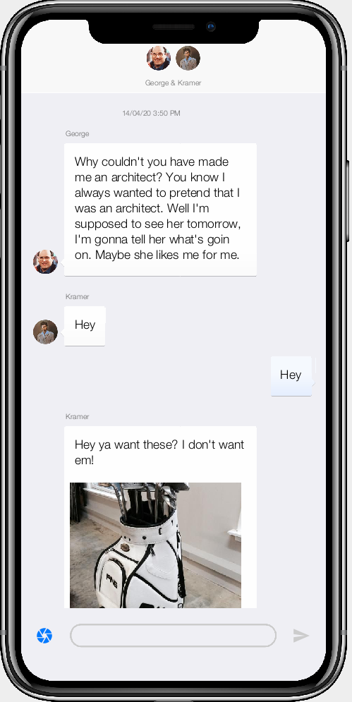

== Customizing Chat Bubbles using CSS

=== Problem

You want customize the look of the chat bubbles using CSS.  E.g. Change the shape, color, border, etc.. of the chat bubble.

=== Solution

You can use CSS to customize many aspects of the chat room view.  You just need to override the styles of the relevant UIIDs in your application's theme.css stylesheet.

TIP: You can find the "theme.css" file inside the "css" directory of your project.

The relevant UIIDs for the chat bubbles are:

.Chat Bubble UIIDs
[width="100%",options="header"]
|====================
| UIID |  Description
| `ChatBubbleSpanLabelOwn` |  The Border/Wrapper around the chat bubbles that the user posts. (I.e. on the right-hand side of the chat room view).  Set background, border, padding on this UIID.
| `ChatBubbleTextOwn` | The text inside the chat bubbles that the user posts.  
|  `ChatBubbleSpanLabelOther` |  The Border/Wrapper around the chat bubbles that "other" users post. (I.e. on the left-hand side of the chat room view).  Set background, border, padding on this UIID.
| `ChatBubbleTextOther` |  The text inside the chat bubbles that other users post. 
| `ChatBubbleTextOtherDesktop` |  The text inside the chat bubbles that other users post on the desktop.
| `ChatBubbleTextOwnDesktop` |  The text inside the chat bubbles that the user posts on the desktop.
|====================

==== Changing The Bubble Color

The default shape of chat bubbles is generated by RoundRect borders.  If all you want to do is change the color of the chat bubbles, then you can simply set the background color on `ChatBubbleSpanLabelOwn` and `ChatBubbleSpanLabelOther`.

.Styles added to css/theme.css to change the chat bubble colors.
[source,css]
----
/* Set the color of the "Other" users' chat bubbles to red */
ChatBubbleSpanLabelOther {
    background-color: red;
}

/* Set text color on "Other" users' chat bubbles. */
ChatBubbleTextOther {
    color: white;
}

/* Set the color of the app user's chat bubbles to green */
ChatBubbleSpanLabelOwn {
    background-color: green;
}

/* Set color of app user's chat bubble text to white. */
ChatBubbleTextOwn {
    color: white;
}
----

And the result:

.Other users' chat bubble is a hideous red color as specified in CSS.

.The app user's chat bubble color is green as specified in CSS.

==== Using a 9-Piece Border

For more complex chat bubble looks you may want to use a 9-piece border, as this will allow you to design any bubble you like in Photoshop, or find an existing chat bubble graphic online.  For this example, we're going to use the following images:

.chat-bubble-left.png

.chat-bubble-right.png

Copy these images into your css/images directory, and then add the following snippet into your project's css/theme.css file:

.css/theme.css File styles to use 9-piece borders for bubbles.
[source,css]
----
ChatBubbleSpanLabelOther {
    border-image: url(images/chat-bubble-left.png); <1>
    cn1-source-dpi: 480; <2>
    border-image-slice: 5% 1% 94% 5%; <3>
    padding-left:1mm;
    padding-right:0;
}

ChatBubbleTextOther {
    margin: 2mm;
    color: black;
}
ChatBubbleSpanLabelOwn {

    border-image: url(images/chat-bubble-right.png);
    cn1-source-dpi: 480;
    border-image-slice: 5% 5% 94% 1%;
    padding-right: 1mm;
    padding-left:0;
}

ChatBubbleTextOwn {
    color: black;
    margin:2mm;
}
----
<1> The `border-image` property specifies the image to use as the background-image.
<2> The `cn1-source-dpi` directive allows you to specify the "source" DPI of the image.  The CSS compiler scales the image to various sizes for use on devices with different densities.  The most commonly used values here are 160, 320, and 480.  You can experiment with values here.  A large value will result in the image appearing smaller in the app.
<3> The `border-image-slice` specifies how the image should be "sliced" to make the 9-piece border.  These values were arrived at using trial and error.  When using 4 values, they are interpreted as `<top> <right> <bottom> <left>`.  E.g the first value specifies the distance from the top edge to slice the image as a percentage of the image height.  See https://github.com/codenameone/CodenameOne/wiki/css#generating-9-piece-image-borders[the Codename One manual's discussion on 9-piece borders] for more details on this directive.

The result:

.The chat bubbles after applying the styles for the 9-piece image border, 

