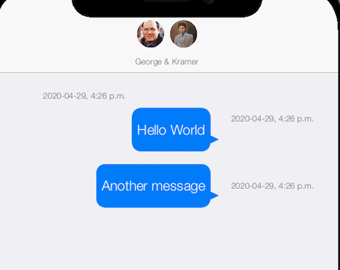

== Disabling Swipe Left to Reveal Time Posted

[discrete]
=== Problem

.Screenshot showing the times of the messages shown along the right.  These are revealed while the user has swiped to the left.

By default the ChatRoomView allows users to swipe a chat bubble to the left to see the time that is was posted.  In some cases this swiping behaviour may interfere with other gestures in your app, so you may wish to disable the behaviour.

[discrete]
=== Solution

Use the https://shannah.github.io/RADChatApp/javadoc/com/codename1/rad/ui/chatroom/ChatBubbleView.html#USE_OVERFLOW_CONTAINER[ChatBubbleView.USE_OVERFLOW_CONTAINER] view property in your view node to disable this behaviour as follows:

[source,java]
----
import static com.codename1.rad.ui.UI.param;

...

Entity viewModel = ....;
Form f = ...;
ViewNode viewNode = new ViewNode(
    param(ChatBubbleView.USE_OVERFLOW_CONTAINER, false),
    
    // .. Other attributes in the view node...
);

ChatRoomView chatView = new ChatRoomView(viewModel, viewNode, f);
...
----

See the complete example code https://github.com/codenameone/CodenameOne/blob/9761ba30903dc1a52e1ca1b21f1296030f924f63/Samples/samples/RADChatRoomTest3/RADChatRoomTest3.java#L125[here].

[discrete]
=== Discussion

The https://shannah.github.io/CodeRAD/javadoc/com/codename1/rad/ui/ViewProperty.html?is-external=true[ViewProperty] is used throughout CodeRAD to add customization of components via the view node hierarchy.  Generally components will declare the view properties that they support in their javadocs, as public static final properties.  That is how the `USE_OVERFLOW_CONTAINER` property is defined in the `ChatBubbleView` component.  This particular view property allows us to "switch" off the swipe left behaviour in the chat room.

[discrete]
=== Further Reading

. https://shannah.github.io/CodeRAD/javadoc/com/codename1/rad/ui/ViewProperty.html?is-external=true[ViewProperty javadocs]
. https://shannah.github.io/RADChatApp/javadoc/com/codename1/rad/ui/chatroom/ChatBubbleView.html#USE_OVERFLOW_CONTAINER[USE_OVERFLOW_CONTAINER javadocs]
. https://github.com/shannah/RADChatApp/issues/18[RFE for this feature]

